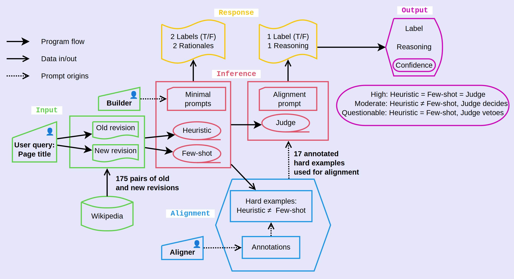

# Noteworthy Differences

Noteworthy differences are important in many scenarios.
For example, you have daily product updates but only want notifications when something important changes.
A goal of alignment is to train AI systems to detect changes that humans think are noteworthy.

This project implements an AI alignment pipeline with a two-stage architecture (classifiers and judge).
The provides not only a label with reasoning but also a confidence estimate.

The data used in this project are old and new revisions of Wikipedia articles.
Here is a summary of the pipeline:

- Two prompts (heuristic and few-shot) are used to classify differences between the revisions as noteworthy or not
- Examples where the prompts *disagree* are forwarded to the human aligner and AI judge (this is the training data)
  - This allows the human aligner to focus on a small number of hard examples
  - The alignment instructions are based on the human aligner's rationales 
- Evalulations are made on the unaligned AI judge (with only minimal prompting) and aligned AI judge
  - The test data is an independent set of hard examples with human annotations
- The process is iterated until satisfactory performance is reached
- For each query, confidence is calculated from agreement among the classifier models and the AI judge



## Interactive usage

Retrieve old and new revisions of an introduction from a Wikipedia article.

```python
from wiki_data_fetcher import *

# Option 1: Get a revision from n days ago
title = "Albert Einstein"
new_info = get_revision_from_age(title, age_days = 0)
old_info = get_revision_from_age(title, age_days = 10)
# Option 2: Get the nth revision before current
json_data = get_previous_revisions(title, revisions = 100)
old_info = extract_revision_info(json_data, 100)

# new_info and old_info are dictionaries:
# {'revid': 1143737878, 'timestamp': '2023-03-09T15:49:20Z'}
# Now get the introduction (the text before the first <h2> heading) for each revision
new_revision = get_wikipedia_introduction(title, new_info["revid"])
old_revision = get_wikipedia_introduction(title, old_info["revid"])
```

Classify the differences between the revisions as noteworthy or not, and provide a rationale.

```python
from models import *
classify(old_revision, new_revision, "heuristic")
```

```
{'noteworthy': True,
 'rationale': 'The differences are noteworthy because the new revision adds the specific outcome of Einstein\'s recommendation (the Manhattan Project), clarifies his famous objection to quantum theory with a direct quote ("God does not play dice"), and provides the full rationale for his Nobel Prize, all of which add significant details about major events and his views.'}
```

## AI alignment pipeline

> [!NOTE]
> Run the pipeline with different Main Pages to make the training and test set.
> Skip the Alignment step for the test set.
 
**Initial preparation:** Run `data/get_titles.R` to extract and save the page titles linked from the Wikipedia Main Page to `data/wikipedia_titles.txt`.
*This is optional; do this to use a newer set of page titles than the ones provided here.*
  
1. **Collect data:** Run `collect_data.py` to retrieve revision id, timestamp, and page introductions for 0, 10, and 100 revisions before current.
The results are saved to `data/wikipedia_introductions.csv`.

2. **Create examples:** Run `create_examples.py` to run the classifier and save the results to `data/examples.csv`.
The model is run up to four times for each example:
two prompt styles (heuristic and few-shot) and two revision intervals (between current and 10th and 100th previous revisions, if available).

3. **Human aligner:** Run `data/extract_disagreements.R` to extract the examples where the heuristic and few-shot classifiers disagree.
These are saved in `data/disagreements_for_human.csv` (only Wikipedia introductions) and `data/disagreements_for_AI.csv` (introductions and classifier responses).
*Without looking at the classifier responses*,
the human aligner fills in the `noteworthy` (True/False) and `rationale` columns in the for-human CSV file and saves it as `data/human_alignments.csv`.

4. **AI judge:** Run `judge_disagreements.py` to run the unaligned judge on the examples where the classifiers disagree.
The results are saved to `data/AI_judgments.csv`.

5. **Alignment:** Run `data/align_judge.R` to collect the alignment data into `data/alignment_text.txt`.
The alignment data consist of True/False labels and rationales from the human aligner and rationales from the heuristic and few-shot prompts.

6. **Evaluate:** Run `judge_disagreements.py --aligned` to run the aligned judge on the examples where the classifiers disagree,
then run `data/summarize_results.R` to compute the summary statistics (results listed below).

## Results

- Wikipedia pages processed: 95
- Available 10th previous revision: 94; 100th previous revision: 81
- Revisions classified as noteworthy with heuristic prompt: 29%; few-shot prompt: 35%
- Disagreements between heuristic and few-shot prompts: 17
  - Classified as noteworthy with heuristic prompt: 3; few-shot prompt: 14
  - Classified as noteworthy by human aligner: 11
  - Classified as noteworthy by **unaligned** AI judge: 17 (65% accurate)
  - Classified as noteworthy by **aligned** AI judge: 12 (94% accurate)

